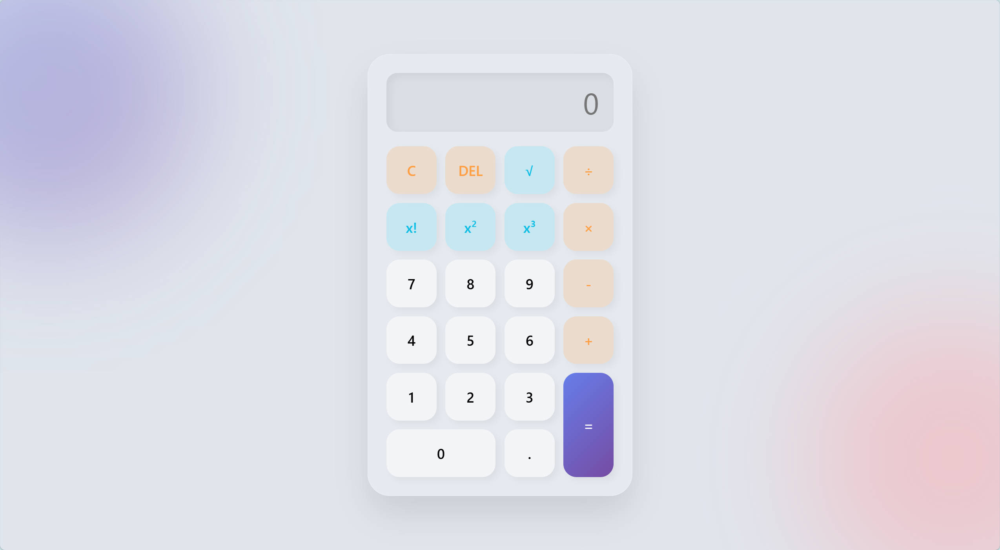

# 🚀 高级科学计算器 | Advanced Scientific Calculator



一个现代、美观的网页科学计算器。采用磨砂玻璃 UI、完善的异常处理、响应式设计，适配 PC 和移动设备。

## ⚡ 快速开始

👉 **[在线体验](https://gusty666.github.io/web-calculator/)** | 📖 **[完整文档](./PRD.md)**

## ✨ 核心特性

| 特性 | 说明 |
|------|------|
| **基础运算** | +、−、×、÷ 支持链式计算与优先级处理 |
| **科学函数** | √（平方根）、x!（阶乘）、x²（平方）、x³（立方） |
| **异常处理** | 完善的错误提示：除以零、负数开方、非整数阶乘 |
| **Glassmorphism** | 磨砂玻璃效果 + 动态背景装饰球 |
| **响应式设计** | 完美适配 PC、平板、手机 (4档布局) |
| **小数点保护** | 单一数字仅允许一个小数点 |

## 🛠 技术栈

- **语言**: HTML5 + CSS3 + JavaScript (ES6+)
- **无依赖**: 原生开发，无第三方框架
- **部署**: GitHub Pages 自动化部署

## 📂 项目结构

```
web-calculator/
├── index.html          # 页面结构 (HTML5 语义化)
├── style.css           # 样式 (Glassmorphism + 响应式)
├── script.js           # 核心逻辑 (通用数学函数)
├── PRD.md              # 完整需求文档 (业务逻辑、测试用例)
├── README.md           # 本文件
└── LICENSE             # MIT 开源协议
```

## 🎯 使用说明

| 操作 | 按键 | 说明 |
|------|------|------|
| 数字输入 | `0-9` | 输入数字 |
| 基础运算 | `+` `-` `*` `/` | 加减乘除 |
| 科学运算 | `√` `x!` `x²` `x³` | 平方根、阶乘、幂运算 |
| 计算结果 | `=` | 执行计算并显示结果 |
| 清除屏幕 | `C` | 清空所有输入 |
| 退格 | `DEL` | 删除最后一个字符 |
| 小数点 | `.` | 输入小数 (防重复) |

## 📖 深入了解

想要了解设计思路、所有异常处理场景和测试用例矩阵？  
👉 **请参考 [完整需求文档 (PRD.md)](./PRD.md)**

该文档包含：
- 业务逻辑流程图与状态机
- 四大类需求的详细定义
- 完整的测试用例矩阵
- 异常处理速查表
- 版本迭代规划

## 🤝 贡献指南

欢迎 Issue 和 Pull Request！

```bash
# 1. Fork 本仓库
# 2. 克隆到本地
git clone https://github.com/YOUR_USERNAME/web-calculator.git

# 3. 创建特性分支
git checkout -b feature/YourFeature

# 4. 提交更改
git commit -m "✨ Add YourFeature"

# 5. 推送并提交 PR
git push origin feature/YourFeature
```

## 📄 许可证

[MIT License](LICENSE) © 2026 Gusty666

---

**用工程思维做好每一个项目** ❤️

